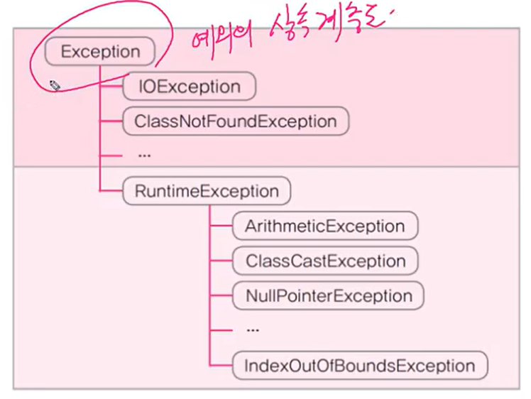

# Genirics

- 컴파일시 타입을 체크해주는 기능 ( compile-time type check ) - JDK1.5
- 객체의 타입 안정성을 높이고 형변환의 번거로움을 줄여줌

```java
 // Tv 객체만 저장할 수 있는 ArrayList를 생성 
ArrayList<Tv> tvList = new ArrayList<Tv>();

tvList.add(new Tv());
tvList.add(new Audio()); // 컴파일 에러 , Tv 외에 다른 타입은 저장 불가 

제네릭스가 나타나기 전에 이렇게 체크해주지 못했다. 
```


```java
ArrayList lst = new ArrayList();
list.add(10);
list.add(20);
list.add("30");

Integer i = (Integer) list.get(2); // 컴파일 OK but 실행하면 ClassCastException 발생
// 컴파일러의 한계

// 실행시 발생에러 -> 프로그램이 죽는다.
// 실행시 에러보다 컴파일 에러가 낫다 ( 컴파일 때 체크해주는 게 낫다 )
```

- 실행시 발생 에러를 컴파일에러로 끌고 오려는 고민의 결과가 제네릭스

  타입 정보를 전달해서 컴파일러가 체크할 수 있도록 진행

  이미 타입 정보를 알고 있어서 형변환 생략 가능


### 제네릭스 장점

- 타입 안정성을 제공
- 타입체크와 형변환을 생략 가능 ⇒ 코드 간결해진다.

제네릭 클래스를 생성할 때 무조건 제네릭을 설정해줘야한다 - jdk1.5 이후



예외 ⇒ Runtime error ( 실행 중 발생에러 )

RuntimeException ( 프로그래머 실수로 발생 에러 )

ClassCastException ( 형변환 예외 )

- 실행 시에 발생하는 것보다 컴파일 타임에 발생하는 게 낫다.  why? 우리가 프로그램 개발 시에 수정이 가능하다.


    Runtime 에러를 ⇒ 컴파일 타임 에러로 가져와서 처리하는게 좋다 
    
    이런 생각 속에 나온 것이 제네릭스
    
    String str = null; 보다 String str = “”; 빈문자열 이 더 좋은 코드 
    
    str.length() 
    
    str이 널일 경우 ⇒ NullPointerException 발생 
    
    빈문자열 일 경우 length 값 0 반환 
    
    배열도 마찬가지 

#### Runtime Error 를 Compiletime Error 로 가져온 것이 제네릭스