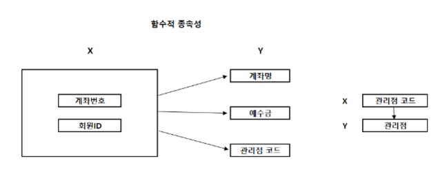

# SQLD 개념 공부 - 데이터 모델과 성능

[[SQLD] 데이터 모델과 성능](https://starrykss.tistory.com/1617)

# 정규화(Normalization)

- 데이터의 일관성, 최소한의 데이터 중복, 최대한의 데이터 유연성을 위한 방법, 데이터를 분해하는 과정
- 데이터 중복을 제거하고 데이터 모델의 독립성을 확보하기 위한 방법
- 정규화를 수행하면 비즈니스에 변화가 발생하여도 데이터 모델의 변경을 최소화할 수 있다.
- 정규화는 제1정규화부터 제5정규화까지 있지만, 실질적으로 제3정규화까지 수행


- 위의 테이블은 정규화를 수행하지 않음, <부서>테이블과 <직원> 테이블을 하나로 합쳐둔 것
    - 새로운 직원이 추가되는 경우
        - <부서> 정보가 없으면 부서코드를 임의의 값으로 넣어야 한다.
            - 불필요한 정보가 함께 추가
        - 새로운 ‘총무부’가 추가되어야 하는 경우
            - 사원 정보가 없기 때문에 임의의 값으로 사원번호를 입력하거나 추가할 수 없게 된다.
- 이러한 문제를 이상현상(Anomaly)이라고 한다.


- 정규화된 모델은 테이블이 분해된다.
    - 테이블이 분해되면, <직원> 테이블과 <부서> 테이블 간에 부서코드로 조인(Join)를 수행하여 하나의 합집합으로 만들 수 있다.
    - 정규화를 수행하면, 불필요한 데이터를 입력하지 않아도 되기 때문에 중복 데이터가 제거

### 정규화 절차

- 제 1정규화
    - 속성(Attribute)의 원자성을 확보한다.
    - 기본키(Primary Key)를 설정한다.
- 제 2정규화
    - 기본키가 2개 이상의 속성으로 이루어진 경우, 부분 함수 종속성을 제거(분해)한다.
- 제 3정규화
    - 기본키를 제외한 컬럼 간에 종속성을 제거(이행 함수 종속성 제거)
- BCNF(Boyce-codd Normal Form)
    - 기본키를 제외하고 후보키가 있는 경우, 후보키가 기본키를 종속시키면 분해한다.
- 제 4정규화
    - 여러 컬럼들이 하나의 컬럼을 종속시키는 경우, 분해하여 다중값 종속성을 제거
- 제 5정규화
    - 조인에 의해서 종속성이 발생하는 경우 분해한다.

## 함수적 종속성(Functional Dependency)

### 1. 제1정규화

- 정규화는 함수적 종속성을 근거로 한다.
    - **함수적 종속성** : X→Y이면 Y는 X에 함수적으로 종속
        - 함수적 종속성은 X가 변화하면 Y도 변화하는지 확인한다.
        - 예) 회원ID가 변화하면 이름도 변경됨
            - 회원ID : 기본키
            - 회원ID가 이름을 함수적으로 종속

- 예시 : 완전 함수 종속성


- <계좌> 테이블 <X>가 <Y>의 컬럼들을 함수적으로 종속하고 있다.
    - <X>는 계좌번호 하나만으로는 유일성을 만족하지 못한다고 가정, 그래서 계좌번호와 회원ID를 기본키로 설정
    - 이처럼 기본키를 잡는 것은 제1정규화

### 2. 제2정규화

- 부분 함수 종속성은 기본키가 2개 이상의 컬럼으로 이루어진 경우 발생
- 기본키가 하나의 컬럼으로 이루어지면 제 2정규화는 생략


- 기본키에 있는 회원ID가 변경이 되면 이름이 변경된다.
    - 회원ID가 이름을 함수적으로 종속하고 있다. ⇒ 부분함수 종속성 발


- 부분 함수 종속성을 제거한 상태
    - 새로운 테이블이 도출, 회원ID가 기본키가 된다.

### 3. 제3정규화

- 제3정규화는 이행 함수 종속성을 제거
    - 이행 함수 종속성 : 기본키를 제외하고 컬럼 간에 종속성이 발생
- 제3정규화는 제1정규화와 제2정규화를 수행한 다음에 해야한다.


- 위처럼 관리점이 관리점 코드에 종속되는 것을 이행 함수 종속성



- 제3정규화를 수행하면 <관리점> 테이블이 도출, 관리점 코드가 기본키가 된다.

### 4. BCNF(Boyce-Codd Normal Form)

- BCNF는 복수의 후보키가 있고, 후보키들이 복합 속성이어야 하며, 서로 중첩되어야 한다.


- 기본키(학번,과목번호)가 교수를 함수적으로 종속하고 있다.
    - 이 때 교수가 후보키(최소성과 유일성 만족)이고, 교수가 과목번호를 함수적으로 종속하는 경우 분해가 일어난다.
        - <교수> 테이블을 새로 만들고, 기본키는 교수, 컬럼은 과목번호가 된다.


# 정규화의 성능

## 정규화의 문제점

- 정규화는 테이블을 분해해서 데이터 중복을 제거하기 때문에 데이터 모델의 유연성을 높인다.
- 정규화는 데이터 조회(SELECT) 시에 조인(Join)을 유발하기 때문에 CPU와 메모리를 많이 사용

- 예시

  

    - 이와  같이 2개의 테이블로 이루어진 경우 “사원번호, 부서코드, 부서명, 이름, 전화번호, 주소”를 조회하려면 조인을 해야 한다.

    ```jsx
    SELECT 사원번호, 부서코드, 부서명, 이름, 전화번호, 주소
    FROM 직원, 부서
    WHERE 직원.부서코드 = 부서.부서코드;
    
    // ANSI JOIN
    SELECT 사원번호, 부서코드, 부서명, 이름, 전화번호, 주소
    FROM 직원 INNER JOIN 부서
    ON 직원.부서코드 = 부서.부서코드;
    
    ```

    - 위의 테이블은 <직원>과<부서> 테이블에서 부서코드가 같은 것을 찾는 것
        - 프로그래밍 코드로 변경한다면 중첩된 루프를 사용해야ㅐ 하낟.

        ```jsx
        for (int i = 0; i < N; i++) 
        	for (int j = 0; j < M; j++) 
        		if (직원_부서코드[i] == 부서_부서코드[j]) { }
        
        // N : 직원 테이블 건수
        // M : 부서 테이블 건수
        ```

        - 결과적으로 이중 for 문을 사용해서 비교하는 기능을 만들어야 조인할 수 있다.
            - 이러한 구조는 데이터양 증가 시 비교해야하는 건수도 증가
        - 실제로 위와 같은 비효율 발생 X
            - 인덱스와 옵티마이저가 사용되기 때문에 이러한 비효율 문제는 해결된다.
        - 결론 : JOIN은 부하를 유발하는 것은 분명
            - 이러한 문제점을 해결하기 위해 반정규화를 하여 하나의 테이블에 저장 → 조인으로 인한 성능 저하는 해결

## 정규화를 사용한 성능 튜닝

- 조인으로 인하여 성능이 저하되는 문제를 반정규화로 해결할 수 있다.
    - 하지만, 반정규화는 데이터를 중복시키는 문제점이 있다. (또다른 문제점 발생)

- 예) <계좌마스터> 테이블


- <계좌마스터>의 컬럼이 계속적으로 증가하면 조인이 최소화 → 조회가 빨라진다.
- 그러나 너무 많은 컬럼이 생기면 1개의 행 크기가 DBMS의 입출력 단위인 블록의 크기를 넘어서게 된다. 그렇게 되면 1개의 행을 읽기 위해 여러 개의 블록을 읽어어 함
- 디스크 입출력이 증가 → 성능이 떨어짐 ⇒ 반정규화의 문제점
- 이럴 경우 테이블을 분해해야 한다. → 정규화 진행
    - 결국 상황에 따른 트레이드 오프를 해야 하는 것

# 반정규화(De-Normalization)

- 데이터베이스의 성능 향상을 위하여, 데이터 중복을 허용, 조인을 줄이는 데이터베이스 성능 향상 방법
- 반정규화는 조회(SELECT) 속도를 향상시키지만 데이터 모델의 유연성은 낮아진다.

## 반정규화를 수행하는 경우

- 정규화에 충실하면 종속성, 활용성은 향상, 수행속도가 느려지는 경우
- 다량의 범위를 자주 처리해야 하는 경우
- 특정 범위의 데이터만 자주 처리하는 경우
- 요약/집계 정보가 자주 요구되는 경우

### 반정규화 절차

1. 대상 조사 및 검토
    - 데이터 처리 범위, 통계성 등을 확인해서 반정규화 대상을 조사
2. 다른 방법 검토
    - 반정규화를 수행하기 전에 다른 방법이 있는지 검토
        - 예) 클러스터링, 뷰, 인덱스 튜닝, 응용 프로그램, 파티션 등을 검토
3. 반정규화 수행
    - 테이블, 속성, 관계 등을 반정규화한다.

### 클러스터링(Clustering)

- 클러스터링 인덱스 : 인덱스 정보를 저장할 때 물리적으로 정렬해서 저장하는 방법
- 따라서 조회 시에 인접 블록을 연속적으로 읽기 때문에 성능이 향상된다.

## 반정규화 기법

### 계산된 컬럼 추가

- 배치 프로그램으로 총판매액, 평균잔고, 계좌평가 등을 미리 계산하고, 그 결과를 특정 컬럼에 추가

### 테이블 수직 분할


- 하나의 테이블을 2개 이상의 테이블로 분할
- 컬럼을 분할하여 새로운 테이블을 만든다.


### 테이블 수평 분할

- 하나의 테이블에 있는 값을 기준으로 테이블을 분할하는 방법


- 파티션(Partition) 기법
    - 데이터베이스에서 파티션을 사용하여 테이블을 분할할 수 있다.
    - 파티션을 사용하면 논리적으로 하나의 테이블이지만, 여러 개의 데이터 파일에 분산되어서 저장
    - 종류
        - Range Partition : 데이터 값의 범위를 기준으로 파티션을 수행
        - List Partition : 특정한 값을 지정하여 파티션을 수행
        - Hash Partition : 해시 함수를 적용하여 파티션을 수행
        - Composite Partition : 범위와 해시를 사용하여 파티션을 수행
    - 장점
        - 데이터 조회시에 액세스(Access) 범위가 줄어들기 때문에 성능 향상
        - 데이터가 분할되어 있기 때문에 I/O 의 성능이 향상된다.
        - 각 파티션을 독립적으로 백업 및 복구가 가능

### 테이블 병합

- 1대1 관계의 테이블을 하나의 테이블로 병합해서 성능을 향상
- 1대N 관계의 테이블을 병합하여 성능을 향상시킨다.
    - 하지만, 많은 양의 데이터 중복이 발생한다.
- 슈퍼타입(Super Type)과 서브 타입(Sub Type) 관계가 발생하면 테이블을 통합하여 성능을 향상시킨다.
    - 예) <고객> 엔티티는 <개인고객>과 <법인고객>으로 분류된다.
        - <고객> : 슈퍼 타입(부모)
        - <개인고객> , <법인고객> : 서브 타입(자식)
    - 관계 종류
        - 배타적 관계
            - <고객>이 <개인고객>이거나 <법인고객>인 경우
        - 포괄적 관계
            - <고객>이 <개인고객>이 될 수도 있고 <법인고객>일 수도 있는 경우


- 슈퍼 타입 및 서브 타입 변환 방법
    - OneToOne Type
        - 슈퍼 타입과 서브 타입을 개별 테이블로 도출
        - 테이블의 수가 많아서 조인이 많이 발생하고 관리가 어렵다.
    - Plus Type
        - 슈퍼 타입과 서브 타입 테이블로 도출
        - 조인이 발생하고 관리가 어렵다.
    - Single Type
        - 슈퍼 타입과 서브 타입을 하나의 테이블로 도출
        - 조인 성능이 좋고 관리가 편리하지만, 입출력 성능이 나쁘다.

# 분산 데이터베이스

- **중앙 집중형 데이터 베이스** : 데이터베이스 시스템 구축 시, 1대의 물리적 시스템에 데이터베이스 관리 시스템을 설치하고 여러명의 사용자가 데이터베이스 관리 시스템에 접속하여 데이터베이스를 사용하는 구조
- **분산 데이터 베이스** : 물리적으로 떨어진 데이터베이스에 네트워크로 연결하여 단일 데이터베이스 이미지를 보여주고, 분산된 작업 처리를 수행하는 데이터베이스
    - 분산 데이터베이스를 사용하는 고객은 시스템이 네트워크로 분산되어 있는지의 여부를 인식 하지 못함, 자신만의 데이터베이스를 사용하는 것처럼 사용 가능
        - 이처럼 데이터베이스는 투명성을 제공해야 한다.

### 분산 데이터베이스의 투명성 종류

- 분할 투명성
    - 고객은 하나의 논리적 릴레이션이 여러 단편으로 분할되어 각 단편의 사본이 여러 시스템에 저장되어 있음을 인식할 필요가 없다.
- 위치 투명성
    - 고객이 사용하려는 데이터의 저장 장소를 명시할 필요가 없다.
    - 고객은 데이터가 어느 위치에 있더라도 통일한 명령을 사용하여 데이터에 접근할 수 있어야 한다.
- 지역 사상 투명성
    - 지역 DBMS에서 물적 데이터베이스 사이의 사상이 보장됨에 따라 각 지역 시스템 이름과 무관한 이름이 사용 가능하다.
- 중복 투명성
    - 데이터베이스 객체가 여러 시스템에 중복되어 존재함에도 고객과는 무관하게 데이터의 일관성이 유지된다.
- 장애 투명성
    - 데이터베이스가 분산되어 있는 각 지역의 시스템이나 통신망에 이상이 발생해도, 데이터의 무결성은 보장된다.
- 병행 투명성
    - 여러 고객의 응용 프로그램이 동시에 분산 데이터베이스에 대한 트랜잭션을 수행하는 경우에도 결과에 이상이 없다.

## 분산 데이터베이스 설계 방식

### 상향식 설계 방식

- 지역 스키마 작성 후 향후 전역 스키마를 작성하여 분산 데이터베이스를 구축한다.

### 하향식 설계 방식

- 전역 스키마 작성 후 해당 지역 사상 스키마를 작성하여 분산 데이터베이스를 구축한다.


- 분산 데이터베이스의 구조

- **하향식 접근 방식**
    - 기업 전체의 전사 데이터 모델을 수렴하여 전역 스키마를 생성 , 각 지역별로 지역 스키마를 생성하여 구축
- **상향식 접근 방식**
    - 지역별로 데이터베이스를 구축한 후에 전역 스키마로 통합하여 구축

- 분산 데이터베이스를 구축하거나 운영할 때, 동일한 DBMS로 분산 데이터 베이스를 구축하는 것은 어렵지 않다.
- 여러 종류의 DBMS가 있으면 연동해야하는데 이 때 데이터베이스 미들웨어(ODBC, JDBC)를 사용해야 한다.

- 분산 데이터베이스의 장점과 단점
    - 장점
        - 데이터베이스의 신뢰성과 가용성이 높다.
        - 분산 데이터베이스가 병렬처리를 수행하기 때문에 빠른 응답이 가능
        - 분산 데이터베이스를 추가하여 시스템 용량확장이 쉽다.
    - 단점
        - 데이터베이스가 여러 네트워크를 통해서 분리되어 있기 때문에 관리와 통제가 어렵다.
        - 보안관리가 어렵다.
        - 데이터 무결성 관리가 어렵다.
        - 데이터베이스 설계가 복잡하다.