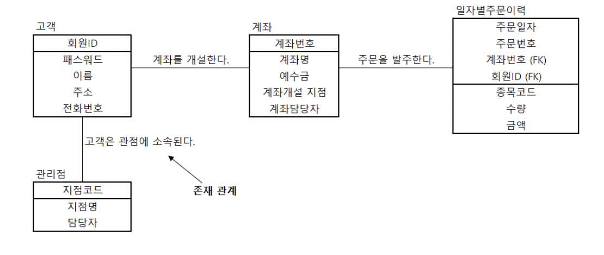
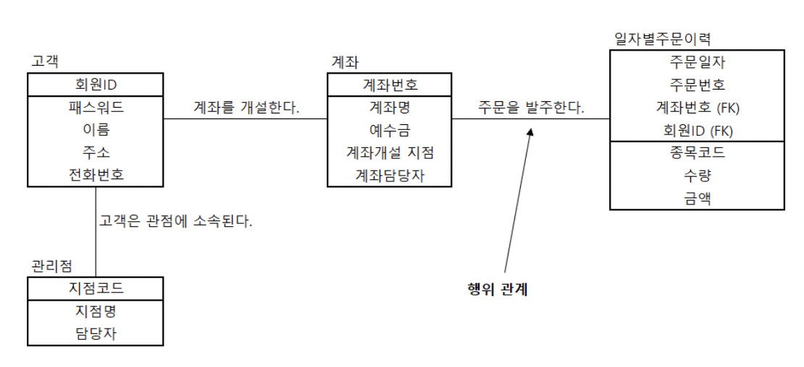
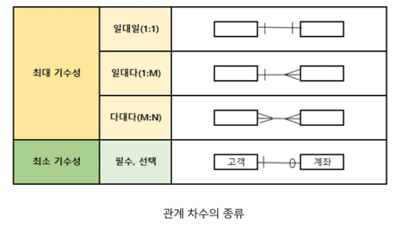

# SQLD 개념 공부 - 데이터 모델링

[[SQLD] 데이터 모델링(Data Modeling)](https://starrykss.tistory.com/1612)

# 1. 데이터 모델링의 이해

## 데이터 모델링

- 현실 세계를 데이터베이스로 표현하기 위해서 추상화 한다.
- 데이터 모델링을 하기 위해서는 고객과의 의사소통을 통해 고객의 업무 프로세스를 이해해야 한다.
- 고객의 업무 프로세스를 이해한 후, 데이터 모델링 표기법을 사용해서 모델링을 한다.
- 고객이 쉽게 이해할 수 있도록 복잡하지 않게 모델링 해야 한다.
- 고객의 업무프로세스를 추상화하고, 소프트웨어를 분석/설계하면서 점점 더 상세해진다.
- 고객의 비즈니스 프로세스를 이해하고 비즈니스 프로세스의 규칙을 정의한다.
    - 정의된 비즈니스 규칙을 데이터 모델로 표현

## 데이터 모델링의 특징

- 데이터 모델링은 추상화해야 한다.
    - 추상화란 공통적인 특징을 찾고 간략하게 표현하는 것을 의미한다.
- 데이터 모델링은 단순화해야 한다.
    - 복잡한 문제를 피하고 누구나 이해할 수 있게 표현
- 데이터 모델링은 명확해야 한다.
    - 의미적 해석이 모호하지 않고 명확하게 해석되어야 한다.

- `추상화(Abstraction)` : 현실 세계를 간략하게 표현
- `단순화(Simplification)` : 누구나 쉽게 이애할 수 있도록 표현
- `명확성(Clarity)` : 명확하게 의미가 해석되어야 하고 한 가지 의미를 가져야 한다.

❗ 데이터 모델링 특징 세가지 암기

- 추상화 → 현실 세계 간략히 표현
- 단순화 → 쉽게 이해하기 위해 표현
- 명확성 → 명확한 의미로 해석, 한가지 의미

## 데이터 모델링의 단계

### 1. 개념적 모델링(Conceptual Data Modeling)

- 고객의 비즈니스 프로세스를 분석, 업무 전체에 대해서 데이터 모델링을 수행한다.
- 복잡하게 표현하지 않고, 중요한 부분을 위주로 모델링하는 단계
- 업무적 관점에서 모델링하며, 기술적 용어는 가급적 사용 X
- 엔티티(Entity)와 속성(Attribute)을 도출하고 개념적 ERD(Entity Relationship Diagram)를 작성한다.

### 2. 논리적 모델링(Logical Data Modeling)

- 개념적 모델링을 논리적 모델링으로 변환하는 작업
- 식별자를 도출하고 필요한 모든 릴레이션을 정의한다.
- 정규화를 수행해서 데이터 모델의 독립성을 확보한다.

### 3. 물리적 모델링(Physical Modeling)

- 데이터 베이스를 실제 구축한다.
    - 테이블, 인덱스, 함수 등을 생성한다.
- 성능, 보안, 가용성을 고려해서 구축한다.

## 데이터 모델링 관점

### 데이터

- 비즈니스 프로세스에서 사용되는 데이터
- 구조 분석, 정적 분석

### 프로세스

- 비즈니스 프로세스에서 수행하는 작업
- 시나리오 분석, 도메인 분석, 동적 분석

### 데이터와 프로세스

- 프로세스와 데이터 간의 관계
- CRUD(Create, Read, Update, Delete) 분석

## 데이터 모델링을 위한 ERD(Entity Relationship Diagram)

- 1976년 피터첸이 만들었으며, 데이터 모델링의 표준으로 사용되고 있음
- 엔티티와 엔티티 간의 관계를 정의하는 모델링 방법

### ERD 작성 절차

1. 엔티티를 도출하고 그린다.
    - 업무에서 관리해야 하는 집합을 도출
2. 엔티티를 배치한다.
    - 엔티티를 도출한 후 엔티티 배치
    - 중요한 엔티티를 왼쪽 상단에 배치
3. 엔티티 간의 관계를 설정
4. 관계명을 서술한다.
    - 엔티티 간의 어떤 행위나 존재가 있는지 표현
5. 관계 참여도를 표현한다.
    - 관계 참여도 : 1개의 엔티티와 다른 엔티티 간의 참여하는 관계 수
    - 일대다 , 일대일 , 다대다 , 다대일
6. 관계의 필수 여부를 표현한다.

### ERD 작성시 고려 사항

- 중요한 엔티티를 가급적 왼쪽 상단에 배치
- ERD는 이해하기 쉬워야 하고 , 너무 복잡하지 않아야 한다.

## 데이터 모델링 고려사항

### 1. 데이터 모델의 독립성

- 독립성이 확보된 모델은 고객의 업무 변화에 능동적으로 대응 가능
- 독립성을 확보하기 위해서는 중복된 데이터를 제거해야 한다.
- 정규화 : 데이터 중복을 제거하는 방법

### 2. 고객 요구 사항의 표현

- 데이터 모델링으로 고객과 데이터 모델러 간에 의사소통을 할 수 있어야 하므로, 고객의 요구사항을 간결하고 명확하게 표현해야 한다.

### 3. 데이터 품질 확보

- 데이터 베이스 구축 시에 데이터 표준을 정의하고 표준 준수율을 관리해야 한다.
- 데이터 표준을 확보해야 데이터 품질을 향상시킬 수 있다.

# 2. 3층 스키마(3-Level Schema)

## 3층 스키마

- 사용자, 설계자, 개발자가 데이터 베이스를 보는 관점에 따라 데이터베이스를 기술하고 이들 간의 관계를 정의한 ANSI 표준
    - ANSI SQL 표준 : SQL문이 모든 데이터베이스 관리 시스템에서 호환되도록 정의한 표준
- 데이터베이스의 독립성을 확보하기 위한 방법
- 데이터의 독립성을 확보하면 다음의 장점을 갖는다.
    - 데이터 복잡도 증가
    - 데이터 중복 제거
    - 사용자 요구사항 변경에 따른 대응력 향상
    - 관리 및 유지보수 비용 절감
- 3단계 계층으로 분리해서 독립성을 확보하는 방법으로, 각 계층을 뷰(View)라고도 한다.
- 3층 스키마의 독립성
    - 논리적 독립성 : 개념 스키마가 변경되더라도 외부 스키마가 영향을 받지 않는 것
    - 물리적 독립성 : 내부 스키마가 변경되더라도 개념 스키마가 영향을 받지 않는 것

## 3층 스키마 구조

### 외부 스키마(External Schema)

- 사용자 관점, 업무상 관련이 있는 데이터 접근
- 관련 데이터베이스의 뷰(View)를 표시한다.
- 응용 프로그램이 접근하는 데이터베이스를 정의

### 개념 스키마(Conceptual Schema)

- 설계자 관점, 사용자 전체 집단의 데이터베이스 구조
- 전체 데이터베이스 내의 규칙과 구조를 표현한다.
- 통합 데이터베이스 구조

### 내부 스키마(Internal Schema)

- 개발자 관점, 데이터베이스의 물리적 저장 구조
- 데이터 저장 구조, 레코드 구조, 필드 정의, 인덱스 등을 의미

# 3. 엔티티(Entity)

## 엔티티(Entity)

- 업무에서 관리해야 하는 데이터 집합
- 저장되고 관리되어야 하는 데이터
- 개념, 사건, 장소 등의 명사

❗여러 사람이 말한 엔티티의 의미

- 엔티티는 변별할 수 있는 사물이다. - Peter Chen(1976)
- 정보를 저장할 수 있는 어떤 것이다. - James Martin(1989)
- 데이터베이스 내부에서 변별 가능한 객체이다. - C.J Date(1986)
- 정보가 저장될 수 있는 장소, 사람, 사건, 개념, 물건 등이다. - Thomas Bruce(1992)

## 엔티티 도출

- 엔티티는 고객의 비즈니스 프로세스에서 관리되어야 하는 정보를 추출해야 한다.

## 엔티티 특징

- 식별자
    - 엔티티는 유일한 식별자가 있어야 한다.
    - 예) 회원 ID
- 인스턴스 집합
    - 2개 이상의 인스턴스가 있어야 한다.
    - 즉, 고객 정보는 2명 이상 있어야 한다.
- 속성
    - 엔티티는 반드시 속성을 가지고 있다.
    - 예) 고객 엔티티에 회원ID , 패스워드, 이름, 주소, 전화번호
- 관계
    - 엔티티는 다른 엔티티와 최소한 1개 이상의 관계가 있어야 한다.
    - 예) 고객은 계좌를 개설한다 (고객과 계좌 엔티티 간의 관계 )
- 업무
    - 엔티티는 업무에서 관리되어야 하는 집합이다.

### ❗릴레이션과 테이블, 인스턴스

- 릴레이션과 테이블은 같은 의미라고 해석하면 된다.
    - 릴레이션에 기본키 및 제약조건을 설정하면 테이블이 된다.
- `RelationShip`은 릴레이션 간의 관계를 의미
- 인스턴스는 릴레이션이 가질 수 있는 값
    - 행의 수를 의미한다.

## 엔티티 종류

### 유형과 무형에 따른 종류

- 분류 기준 : 물리적 형태의 존재 여부

- 유형 엔티티(Tangible Entity)
    - 업무에서 도출되며 지속적으로 사용되는 데이터
    - 예 ) 고객, 강사, 사원 등
- 개념 엔티티(Conceptual Entity)
    - 유형 엔티티는 물리적 형태가 있지만, 개념 엔티티는 물리적 형태가 없다.
    - 개념적으로 사용되는 엔티티
    - 예) 거래소 종목, 코스닥 종목, 생명보험 상품
- 사건 엔티티(Event Entity)
    - 비즈니스 프로세스를 실행하면서 생성되는 엔티티
    - 예) 주문 체결, 취소주문, 수수료 청구 등

### 발생 시점에 따른 종류

- 기본 엔티티(Basic Entity)
    - 키 엔티티라고도 한다.
    - 다른 엔티티로부터 영향을 받지 않고 독립적으로 생성되는 엔티티
    - 예) 고객, 상품, 부서 등
- 중심 엔티티(Main Entity)
    - 기본 엔티티와 행위 엔티티 간의 중간에 있는 것
    - 기본 엔티티로부터 발생되고 행위 엔티티를 생성하는 것
    - 예) 계좌, 주문, 취소, 체결 등
- 행위 엔티티(Active Entity)
    - 2개 이상의 엔티티로부터 발생하는 것
    - 예) 주문 이력, 체결 이력 등

# 4. 속성(Attribute)

- 업무에서 필요한 정보인 엔티티가 가지는 항목
- 더 이상 분리되지 않는 단위, 업무에 필요한 데이터를 저장할 수 있다.
- 인스턴스의 구성요소, 의미적으로 더 이상 분해되지 않음

## 속성의 특징과 종류

### 속성의 특징

- 속성 : 업무에서 관리되는 정보
- 속성은 하나의 값만 가진다.
- 주식별자에게 함수적으로 종속된다.
    - 기본키가 변경되면, 속성의 값도 변경된다.

### 속성의 종류

- 분해여부에 따른 속성의 종류
    - 단일(값) 속성(Single-valued Attribute)
        - 하나의 의미로 구성된 것
        - 예) 회원 ID, 이름 등
    - 복합 속성(Composite Attribute)
        - 여러 개의 의미가 있는 것
        - 예) 주소(시, 군, 동 등으로 분해 가능)
    - 다중값 속성(Multi-valued Attribute)
        - 속성에 여러 개의 값을 가질 수 있는 것
        - 예) 상품 리스트
        - 다중값 속성은 엔티티로 분해된다.
- 특성에 따른 속성의 분류
    - 기본 속성 (Basic Attribute)
        - 비즈니스 프로세스에서 도출되는 본래의 속성
        - 예) 회원ID, 이름, 계좌번호, 주문일자 등
    - 설계 속성 (Designed Attribute)
        - 데이터 모델링 과정에서 발생되는 속성
        - 유일한 값을 부여
        - 예) 상품코드, 지점 코드 등
    - 파생 속성(Derived Attribute)
        - 다른 속성에 의해서 만들어지는 속성
        - 예) 합계, 평균

❗도메인(Domain)

- 속성이 가질 수 있는 값의 범위

# 5. 관계(Relationship)

- 관계 : 엔티티 간의 관련성
- 분류
    - 존재 관계 : 2개의 엔티티가 존재 여부의 관계가 있는 것
    - 행위 관계 : 2개의 엔티티가 어떤 행위에 의한 관련성이 있는 것

## 관계의 종류

### 존재 관계

- 엔티티 간의 상태를 의미
- 예) 고객이 은행에 회원가입을 하면, 관리점이 할당되고, 그 할당된 관리점에서 고객을 관리

  

### 행위 관계

- 엔티티 간에 어떤 행위가 있는 것
- 예) 계좌를 사용해서 주문을 발주하는 관계
    - 증권회사는 계좌를 개설하고 주문을 발주한다.S

      

## 관계 차수 (Cardinality)

- 두 개의 엔티티 간에 관계에 참여하는 수
- 예) 1명의 고객은 여러 개의 계좌를 개설할 수 있다.
    - 1 대 N 관계

  

### 관계 차수의 종류

- 1대1 관계
    - 완전 1대1 : 하나의 엔티티에 관계되는 엔티티의 관계가 하나인 경우, 반드시 존재한다.
    - 선택적 1대1 : 하나의 엔티티에 관계되는 엔티티의 관계가 하나이거나 없을 수도 있다.
- 1대N 관계
    - 엔티티에 행이 하나 있을 때 다른 엔티티의 값이 여러 개 있는 관계
    - 예) 고객은 여러 개의 계좌를 가질 수 있다.
- M대N 관계
    - 2개의 엔티티가 서로 여러 개의 관계를 가지고 있는 것
    - 예) 1명의 학생이 여러개의 과목을 수강할 수 있다.
        - 반대로, 한 개의 과목은 여러 명의 학생이 수강한다.
            - M대N 관계의 발생
    - 관계형 데이터베이스에서 M대N 관계의 조인(Join)
        - 카테시안 곱(Cartesian Product)의 발생
            - M대 N의 관계를 1대N, N대1로 해소해야 함.
- 필수적 관계와 선택적 관계
    - 필수적 관계는 ‘|’ 로 표현, 선택적 관계는 ‘O’로 표현된다.
    - 필수적 관계 : 반드시 하나가 있어야 하는 관계
        - 예) 고객이 반드시 있어야 계좌를 개설할 수 있다.
    - 선택적 관계 : 없을 수도 있는 관계
        - 예) 고객은 있지만, 계좌가 없을 수도 있다면 선택적 관계

## 식별관계와 비식별 관계

### 식별관계(Identification Relationship)

- 강한 개체의 기본키가 다른 엔티티의 기본키의 하나로 공유되는 관계
- <고객>과 <계좌> 엔티티에서 <고객>은 독립적으로 존재할 수 있는 강한 개체(Strong Entity)
    - 강한 개체(Strong Entity) - <고객>
        - 누구에게도 지배되지 않는 독립적인 개체
        - 어떤 다른 엔티티에게 의존하지 않고 독립적으로 존재
        - 다른 엔티티와 관계를 가질 때, 다른 엔티티에게 기본키를 공유
        - 식별 관계로 표현된다.
            - <고객> 엔티티의 기본적인 회원ID를 <계좌> 엔티티의 기본키의 하나로 공유하는 것
        - 기본키 값이 변경되면, 식별 관계(기본키를 공유받은)에 있는 엔티티의 값도 변경된다.
    - 약한 개체(Weak Entity) : <계좌>
        - 개체의 존재가 다른 개체의 존재에 달려 있는 개체

      ⇒ 종속적인 느낌

### 비 식별 관계(Non-Identification Relationship)

- 강한 개체의 기본키를 다른 엔티티의 기본키가 아닌 일반 컬럼(열)으로 관계를 가지는 것
- 점선으로 표현됨

# 6. 엔티티 식별자(Entity Identifier)

- 식별자 : 엔티티를 대표할 수 있는 유일성을 만족하는 속성
- 예) 회원ID, 계좌번호, 주민등록번호, 외국인등록번호 등

## 주식별자(기본키, Primary Key)

- 최소성 : 주식별자는 최소성을 만족하는 키
- 대표성 : 주식별자는 엔티티를 대표할 수 있어야 한다.
- 유일성 : 주식별자는 엔티티의 인스턴스를 유일하게 식별한다.
- 불변성 : 주식별자는 자주 변경되지 않아야 한다.

### 데이터베이스 키의 종류

- 기본키(Primary Key) : 후보키 중에서 엔티티를 대표할 수 있는 키
- 후보키(Candidate Key) : 유일성과 최소성을 만족시키는 키
- 슈퍼키(Super Key) : 유일성은 만족하지만, 최소성을 만족하지 않는 키
- 대체키(Alternate Key) : 여러 개의 후보키 중에서 기본키를 선정하고 남은 키
- 외래키(Foreign Key)
    - 하나 혹은 다수의 다른 테이블의 기본키 필드를 가리키는 것
    - 참조 무결성(Referential Integrity)을 확인하기 위해 사용되는 키
    - 허용된 데이터 값만 데이터 베이스에 저장하기 위해 사용

## 식별자의 종류

- 식별자는 대표성, 생성 여부, 속성의 수, 대체 여부로 분류된다.

### 식별자의 대표성

- 주식별자 : 엔티티를 대표할 수 있는 식별자
    - 예) 회원ID가 <고객> 엔티티의 주식별자가 됨.
- 대표성 여부에 따른 식별자의 종류
    - 주식별자
        - 유일성과 최소성을 만족, 엔티티를 대표하는 식별자
        - 다른 엔티티와 참조 관계로 연결될 수 있다.
    - 보조 식별자
        - 유일성과 최소성은 만족하지만 대표성을 만족하지 못하는 식별자

### 생성 여부

- 생성 여부에 따른 식별자 종류
- 내부 식별자
    - 엔티티 내부에서 스스로 생성되는 식별자
    - 예) 부서코드, 주문번호, 종목코드 등
- 외부 식별자
    - 다른 엔티티와의 관계로 인하여 만들어지는 식별자
    - 예) <계좌> 엔티티의 회원ID

### 속성의 수

- 속성의 수에 따른 식별자 종류
- 단일 식별자
    - 하나의 속성으로 구성
    - 예) <고객> 엔티티의 회원ID
- 복합 식별자
    - 2개 이상의 속성으로 구성

### 대체 여부

- 대체 여부에 따른 식별자의 종류
- 본질 식별자
    - 비즈니스 프로세스에서 만들어지는 식별자
- 인조 식별자
    - 인위적으로 만들어지는 식별자
    - 다음의 경우에 사용
        - 후보 식별자 중에서 주식별자로 선정할 것이 없을 경우
        - 주식별자가 너무 많은 컬럼으로 되어 있는 경우
    - 순서번호(Sequence Number)를 사용해서 식별자를 만든다.