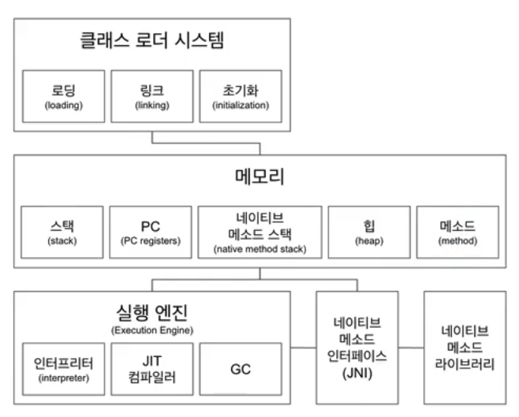

# JVM 구조

- 크게 네가지 , 작게 5가지 컴포넌트로 나뉘어져있다.
    - 클래스 로더 , 메모리, 실행 엔진 , (JNI , 네이티비 메소드 라이브러리) ⇒ 묶어서 하나로 볼 수 있다.
- class 파일엔 바이트코드가 존재

### 클래스 로더

- 로딩(loading)
    - 클래스 파일 읽어오는 과정
- 링크(linking)
    - 레퍼런스를 연결하는 과정
- 초기화(initialization)
    - static 값들 초기화 및 변수에 할당

### 메모리

크게 다섯가지 영역이 나뉘어져있다.

메소드 영역이 중요하다.

- 메소드 영역
    - 클래스 수준의 정보를 저장 , `공유자원` ⇒ 다른 영역에서도 사용할 수 있는 자원
        - 클래스 이름(풀패키지 경로)
        - 부모 클래스 이름
        - 메소드 이름
        - 변수 이름
- 힙 영역
    - 실제 인스턴스들 저장, 공유
- 힙과 메서드는 모든 영역에 공유 , 나머지 메모리 공간에서는 스레드에 국한되어있다.
- 스택 영역
    - 쓰레드마다 런타임 스택을 만든다. 그 안에 메소드 호출을 스택 프레임이라 부르는 블럭으로 쌓는다. 쓰레드 종료되면 런타임 스택도 사라진다.
- PC(Program Counter) 레지스터 : 쓰레드마다 쓰레드 내 현재 실행할 스택 프레임을 가리키는 포인터 생성
- 네이티브 메소드 스택 : 네이티브 메소드를 호출할 때 마다 생기는 별도의 스택 (쓰레드마다 생성)

❗네이티브 메소드 : 메소드에 native라는 키워드가 붙어있고, C, C++로 구현한 메소드

**실제 구현된 것을 네이티브 메소드 라이브러리**

### 실행 엔진

- 인터프리터 : 바이트 코드를 이해할 수 있어서 한줄 한줄씩 실행한다. ( 네이티브 코드로 바꿔서 실행한다. )
    - 매 한 줄 마다 바이트 코드 → 네이티브 언어로 컴파일하면서 실행하는 것
    - 똑같은 코드가 여러번 나와도 매번 네이티브 코드로 바꾸는 것이 비효율적
        - 이럴 때 JIT 컴파일러로 보낸다. , JIT 컴파일러는 반복되는 코드를 미리 다 네이티브 코드로 변경해놓는다.
            - 프로그램 실행 속도 상승

- **GC**
    - 이해 필요, 필요에 따라 커스터마이징을 할 수도 있어야한다.
    - **더이상 참조되지 않는 객체를 모아서 정리**한다.

### 정리

클래스로더 ( 읽기 ) → 메모리 ( 데이터 저장 ) → 실행 엔진 ( 실행 및 정리 )

메모리와 실행엔진이 네이티브 라이브러리를 사용한다면 JNI를 통해서 사용