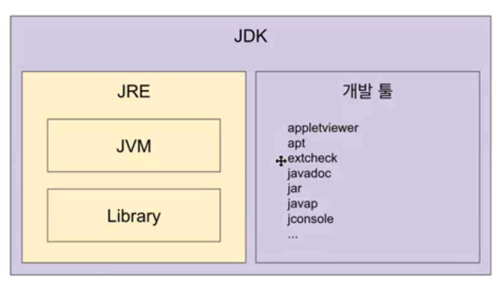

# 자바, JVM, JDK 그리고 JRE

### JVM (Java Virtual Machine)

- 자바 가상 머신
- 바이트 코드를 실행하는 표준(JVM 자체는 표준)이자 구현체(특정 밴더가 구현한 JVM)다.
- 실행하기 (인터프리터 , JIT 컴파일러) : 머신이 이해할 수 있는 OS에 특화된 코드로 변환하여 실행
- JVM 스펙은 여러 밴더에 따라 구현이 다르다
- JVM 밴더 : 오라클 , 아마존 , Azul 등
- 특정 플랫폼(OS에 맞춰서)에 종속적

⇒ JVM만 따로 배포되지 않는다. 최소 배포판은 JRE이다.

### JRE (Java Runtime Environment)

- 자바 애플리케이션을 실행할 수 있도록 구성된 배포판
- JVM + 핵심 라이브러리(rt.jar , charset.jar 등)
- 자바를 개발하는데 필요한 툴은 구성 X (javac는 들어있지 않음)

javac는 JDK에 들어있다.

### JDK (Java Development Kit)

- JRE + 개발에 필요한 툴
- 소스 코드를 작성할 때 사용하는 자바 언어는 플랫폼에 독립적
- 오라클은 자바 11부터 JDK만 제공 , JRE를 따로 제공하지 않는다.

❗ 자바 9부터 jlink를 통해 나만의 JRE를 구성할 수 있다. (9부터 모듈시스템이 들어왔다)

### Java

- .java 안에 있는 언어를 자바라고 한다. (프로그래밍 언어)
- 오라클 JDK 11 버전부터 사용으로 사용할 때 유료, (자바가 유료가 아니다.)
    - 여러 JDK 중에서 오라클 JDK 11부터 유료이다.

### 타 프로그래밍 언어 지원

- JVM 기반으로 동작하는 프로그래밍 언어
    - 클로저, 그루비, JRuby, Jython, Kotlin, Scala 등등
    - 중간에 클래스 파일만 있으면 실행해준다. ( 자바와 의존성이 타이트하지 않다 )