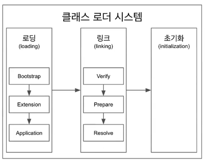

# 클래스 로더



- 로딩, 링크, 초기화 순으로 진행

### 로딩

- 클래스 로더가 .class 파일을 읽어서 적절한 바이너리 데이터를 만들어서 메소드 영역 (메모리) 안에다가 클래스 정보(풀패키지 경로 클래스 이름(FQCN), 클래스 | 인터페이스 | 이늄 | 메소드와 변수 )를 저장한다.
- 로딩이 끝나면 클래스 타입의 Class 객체를 생성하여 힙 영역에 저장

    ```java
    public class Test {
    	public void test() {
         // 로딩이 끝나면 힙 영역에 Class<Test> 의 객체가 만들어 진다. 
    	}
    }
    ```


- 클래스 로더는 여러가지가 있다.
    - 부트 스트랩 클래스로더
        - JAVA_HOME/lib에 있는 코어 자바 API 제공
        - 최상위 우선 순위를 가진 클래스 로더
    - 플랫폼 클래스로더(익스텐션 클래스로더라고 불렀었음)
        - JAVA_HOME/lib/ext 폴더 또는 java.ext.dirs 시스템 변수에 해당하는 위치에 있는 클래스를 읽는다.
    - 애플리케이션 클래스로더
        - 애플리케이션 클래스패스(애플리케이션 실행할 때 주는 classpath 옵션 또는 java.class.path 환경 변수의 값에 해당하는 위치)에서 클래스를 읽는다.

    ```java
    public class App {
    	public static void main(String[] args) {
    		ClassLoader classLoader = App.class.getClassLoader();
    		System.out.println(classLoader);
    		System.out.println(classLoader.getParent());
    		System.out.println(classLoader.getParent().getParent());
    	}
    }
    ```

  **결과값**

  

    - 클래스 로더는 계층형 구조
    - 부트스트랩 클래스로더는 네이티브 코드로 구현이 되어있어서 볼 수가 없다.(vm마다 다르다) 그래서 null로 결과값이 나타난다.
    - 개발자가 작성한 코드들은 99% 애플리케이션 클래스로더가 읽는다.

    - 동작 방식
        - 클래스 읽는 요청이 들어오면 최상위 부모부터 동작
        - 부모가 못 읽으면 그 아래 로 전달
        - 마지막 클래스로더도 못 읽으면 ClassNotFoundException 발생

### 링크

- Verify , Prepare , Resolve(optional) 세단계
    - verify : .class 파일 형식이 유효한지 체크
    - Preparation : 클래스 변수(static 변수)와 기본 값에 필요한 메모리 준비해두는 과정
    - Resolve : 심볼릭 메모리 레퍼런스를 메소드 영역에 있는 실제 레퍼런스로 교체한다. (Optional)
        - 링크에서 할 수도 있고, 실제 레퍼런스가 사용될 때 실행될 수 있다.
        - ❗심볼릭 메모리 레퍼런스 : 실제 레퍼런스를 가르키는 것이 아니고 논리적인 레퍼런스를 가르키고 있다.

### 초기화

- static 변수의 값을 할당
- 준비해놓은 메모리 영역에다가 값을 할당
- static 변수들은 초기화에 값이 할당된다.